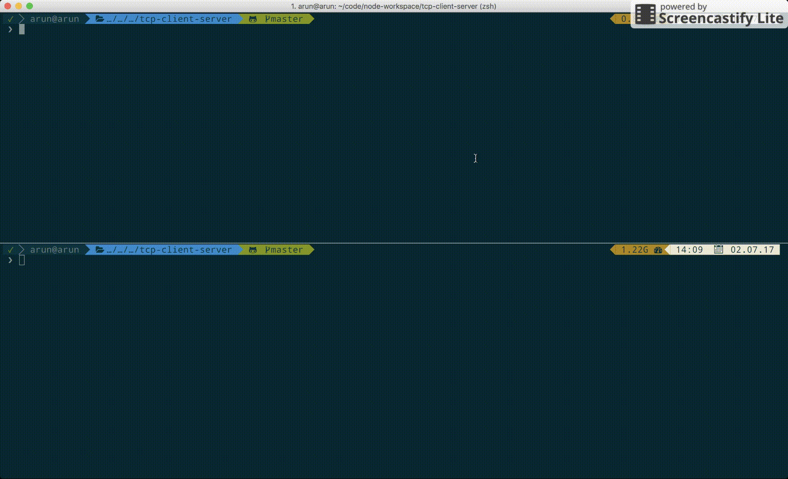

# tcp-client-server
TCP Client Server example

# Pre-requisites
Ensure that node is installed

# How to run this program??
1. `cd ${working-directory}`
2. `npm install`
3. `node server.js`
4. And in another terminal in the same dir, `node client.js`

# Preview

